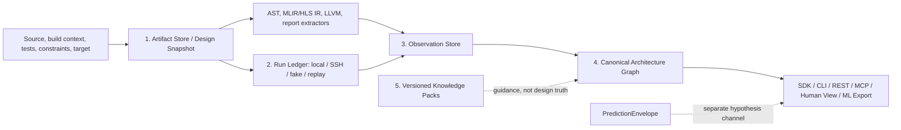

# Architecture

HLSGraph is an evidence infrastructure layer for HLS coding agents, LLM4HLS,
and ML4HLS. It creates a deterministic, traceable view of an HLS design without
asking an LLM to invent topology or QoR.

The supported unit in v0.1 is one HLS kernel. The schema leaves room for
component/system entities, host programs, multiple compute units, DDR/HBM
banks, and platform interconnect, but HLSGraph does not yet provide complete
collection for those entities.

## Non-negotiable truth boundaries

1. A software call graph is not an HLS architecture graph. Source and AST facts
   can anchor functions, loops, variables, calls, and directives, but only an
   appropriate IR, schedule/binding result, or tool report can justify a
   hardware/dataflow relation.
2. Graph facts are extracted deterministically. LLMs read facts and may propose
   hypotheses; they do not create factual graph edges or synthesis results.
3. Every pragma or external directive is attached to an explicit scope. Missing
   or ambiguous scope is reported as incomplete instead of guessed.
4. Predictions and hypotheses stay outside the observation plane; displaying a
   value on a graph node does not make it a tool observation.
5. Functional correctness, resource fit, and post-route timing are three
   independent gates.

## Five data planes



### 1. Artifact Store and Design Snapshot

`ArtifactRef` records a namespaced kind, project-relative URI, SHA-256, size,
producer, license, access policy, and retention policy. Source artifacts use
external retention and private access by default; their bodies are not copied
into SQLite. Explicitly managed artifacts are content-addressed under the local
`.hlsgraph/artifacts/` directory.

A `DesignSnapshot` hashes the manifest, artifacts, build context, target,
constraints, toolchain, and extraction profile. Changing a macro, top,
directive/config file, part, clock, tool version, or extractor selection therefore
creates a different snapshot identity. Snapshots are immutable ledger records.

### 2. Run Ledger

`ToolRun` records an immutable request and result: snapshot, stage, backend,
argv, toolchain, environment hash, inputs/outputs, timestamps, status,
diagnostics, gates, and a classified failure. License, SSH, timeout,
infrastructure, benchmark, design-compile, correctness, resource, and timing
failures remain distinguishable.

The generic stage order is:

```text
INDEX -> CSIM -> CSYNTH -> RTL_COSIM -> RTL_EXPORT -> VIVADO_SYNTH -> POST_ROUTE
```

Only commands explicitly declared by the project owner are executable. Local
and SSH runners are disabled unless the caller opts in; the CLI additionally
requires `--allow-execution`. Fake and replay runners support CI and cache tests
without pretending to be fresh tool truth. Local cache identity includes a hash
of the inherited environment. SSH quotes one complete `bash -lc` command and
performs a remote size/SHA-256 handshake for the active snapshot inputs plus an
explicit toolchain/environment probe whose stdout SHA-256 must match the pinned
value before execution. Failed or unattested runs cannot be replayed as
successful cache hits or reported as tool truth.

Declared-output ingestion is a separate, fail-closed capability: a runner must
explicitly advertise `provides_local_output_bytes` before HLSGraph will hash and
import output bytes. An unknown or custom runner without that capability is
rejected. The v0.1 SSH runner can execute attested commands, but cannot ingest
declared outputs because it does not return independently transferred,
hash-verified local bytes; external synchronization timing is not evidence.

### 3. Observation Store

An `Observation` is an atomic statement with a subject, predicate, value/unit,
stage, authority class, run/artifact provenance, optional source or IR anchor,
workload, and completeness. Conflicting observations can coexist. HLSGraph does
not overwrite a csynth estimate with a post-route measurement, or turn a
workload-specific stall count into an unconditional property.

Deterministic computations are stored separately as `Derivation` records that
name the algorithm/version and cite their input observation IDs. Verification
results are also separate records.

### 4. Canonical Architecture Graph

The graph is the bounded, agent-friendly projection of entities and explicit
relations: kernel/component, process/region, loop, stream/buffer, memory, port,
directive, and schedule/binding structures. Stable IDs include the immutable
snapshot identity. Cross-layer AST-to-IR-to-schedule-to-RTL mappings may be
many-to-many; ambiguity and missing coverage are first-class states.

Full ASTs, individual LLVM instructions, RTL/netlist cells, and waveforms are
not expanded into the default graph. They remain artifacts or opt-in evidence
subgraphs. RTL and physical implementation follow a summary-and-link model.

### 5. Knowledge Packs

Knowledge packs contain versioned, project-authored rules with
`document_id + document_version + section + applicability + rule_id + citation`.
They interpret public documentation but do not describe a particular design.
The repository does not redistribute vendor PDFs, extracted full text, or large
quotes. See [the knowledge pack policy](governance/KNOWLEDGE_PACK_POLICY.md).

## Extraction architecture

- **Source/AST:** `libclang` is the normal path and consumes the compilation
  context (preferably `compile_commands.json`). Missing libclang/context is an
  indexing error. The regex scanner runs only when the caller explicitly asks
  for degraded mode; diagnostics and health retain that fact. Project-local
  quote/angle includes, include/forced-include flags, and response files are
  hashed. If libclang nevertheless reads an untracked project-local file (for
  example through a macro include), indexing fails instead of accepting an
  unsound snapshot.
- **Directives:** inline pragmas, Tcl, and config declarations are normalized,
  scoped, and resolved by declared precedence. Declared effectiveness is not
  the same as proof that a tool applied the directive.
- **MLIR/HLS IR:** text adapters preserve dialect operation and location
  evidence. Hardware/dataflow projection occurs only for supported semantics,
  such as explicit Handshake relations; generic SSA flow is not promoted to
  hardware topology.
- **LLVM IR:** operations, blocks, CFG, memory access, calls, and debug locations
  are evidence. LLVM CFG edges remain LLVM relations, not HLS dataflow edges.
- **Schedule/binding and reports:** Vitis HLS/Vivado are the first supplied
  adapters. They import achieved II/latency/resource, directive status,
  schedule, cosim/dataflow workload evidence, and post-route summaries when
  those artifacts are present. Generic Vivado reports require an explicit
  implementation stage. Design gates additionally require an explicit scope
  matching the current top instance, target part/platform, and timing clock;
  unscoped values remain artifact evidence. Resource fit requires one scoped
  post-route utilization artifact with a complete one-to-one capacity key set.
- **Plugins:** explicitly selected `hlsgraph.extractors.v1` entry points can add
  dialect or vendor adapters. Installed plugins are not executed merely by
  opening a bundle. Entity, relation, artifact, and predicate kinds are
  namespaced rather than frozen vendor enums.

The canonical schema and query service are vendor-neutral. “Vitis-first” means
the initial adapters and fixtures target AMD report semantics; it does not make
AMD concepts the universal schema.

## Service architecture

The Python SDK, CLI, REST adapter, and MCP facade delegate graph search and
evidence exploration to the same `CoreService`. REST and MCP are read-only.
The human view is a separate self-contained HTML presentation of the canonical
graph, with stage/authority filtering and evidence details. ML export emits
deterministic JSONL (and optional Parquet/PyG) while keeping static features,
observations, labels, and predictions physically distinct.

## Current implementation boundary

v0.1 can index a single-kernel manifest, parse the supplied source/IR/report
formats, persist an append-oriented SQLite ledger, query and render an active
snapshot, run explicitly configured generic local/SSH stages, and export ML
tables. CI uses synthetic fixtures and no vendor installation.

It does **not** yet claim turnkey Vitis/Vivado flow generation, complete coverage
of every report/dialect, full system/platform topology, board telemetry
collection, netlist-scale graph expansion, or a repository-provided real-vendor
end-to-end result. Those require optional toolchains and independently licensed
design evidence.
