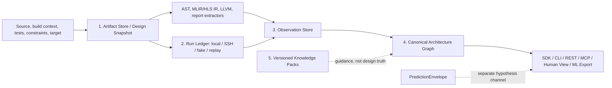

# Architecture

HLSGraph is an evidence infrastructure layer for HLS coding agents, LLM4HLS,
and ML4HLS. It creates a deterministic, traceable view of an HLS design without
asking an LLM to invent topology or QoR.

The fully supported unit in v0.3.0 is one HLS kernel/component. The schema leaves room for
component/system entities, host programs, multiple compute units, DDR/HBM
banks, and platform interconnect, but HLSGraph does not yet provide complete
collection for those entities.

## Non-negotiable truth boundaries

1. A software call graph is not an HLS architecture graph. Source and AST facts
   can anchor functions, loops, variables, calls, and directives, but only an
   appropriate IR, schedule/binding result, or tool report can justify a
   hardware/dataflow relation.
2. Graph facts are extracted deterministically. LLMs read facts and may propose
   hypotheses; they do not create factual graph edges or synthesis results.
3. Every pragma or external directive is attached to an explicit scope. Missing
   or ambiguous scope is reported as incomplete instead of guessed.
4. Predictions and hypotheses stay outside the observation plane; displaying a
   value on a graph node does not make it a tool observation.
5. Functional correctness, resource fit, and post-route timing are three
   independent gates.

## Five data planes



### 1. Artifact Store and Design Snapshot

`ArtifactRef` records a namespaced kind, project-relative URI, SHA-256, size,
producer, license, access policy, and retention policy. Source artifacts use
external retention and private access by default; their bodies are not copied
into SQLite. Explicitly managed artifacts are content-addressed under the local
`.hlsgraph/artifacts/` directory.

A `DesignSnapshot` hashes the manifest, artifacts, build context, target,
constraints, toolchain, and extraction profile. Changing a macro, top,
directive/config file, part, clock, tool version, or extractor selection therefore
creates a different snapshot identity. Snapshots are immutable ledger records.

### 2. Run Ledger

`ToolRun` records an immutable request and result: snapshot, stage, backend,
argv, toolchain, environment hash, inputs/outputs, timestamps, status,
diagnostics, gates, and a classified failure. License, SSH, timeout,
infrastructure, benchmark, design-compile, correctness, resource, and timing
failures remain distinguishable.

The generic stage order is:

```text
INDEX -> CSIM -> CSYNTH -> RTL_COSIM -> RTL_EXPORT -> VIVADO_SYNTH -> POST_ROUTE
```

Only commands explicitly declared by the project owner are executable. Local
and SSH runners are disabled unless the caller opts in; the CLI additionally
requires `--allow-execution`. Fake and replay runners support CI and cache tests
without pretending to be fresh tool truth. Local cache identity includes a hash
of the inherited environment. SSH passes one completely quoted Python remote
executor command as the final SSH argument; it does not depend on a remote
`bash -lc` wrapper. That executor creates the unique run directory, receives
the active snapshot inputs, performs their size/SHA-256 handshake, and runs an
explicit toolchain/environment probe whose stdout SHA-256 must match the pinned
value before execution. Failed or unattested runs cannot be replayed as
successful cache hits or reported as tool truth.

Declared-output ingestion is a separate, fail-closed Runner v2 capability. The
SDK creates a unique run-scoped staging directory; a runner may return only
declared outputs. An SSH runner creates a non-reusable remote run directory,
verifies the active snapshot inputs, executes the declared stage, freezes the
declared outputs, computes a remote size/SHA-256 manifest, and transfers those
bytes directly into SDK-owned staging. The SDK then revalidates relative paths,
links/reparse points, sizes, hashes, and file identity before atomically
committing the artifacts and run ledger. Mutagen, rsync, shared mounts, and
other asynchronous synchronization may support development, but their timing
is never accepted as evidence transport.

A real-tool claim also requires a pipeline-issued execution capability.  After
`StageOrchestrator` validates an approved built-in Local/SSH runner (or an
explicitly loaded trusted runner plugin), it creates a process-local, one-shot,
non-serializable authorization.  The authorization binds the runner identity
and fingerprint, request and stable run IDs, snapshot/manifest/build/target/
constraint/toolchain hashes, and every declared output path/kind/content hash.
The ledger consumes that authorization atomically and persists a public
`ExecutionAttestation` plus `ExecutionCommitReceipt`.  Reconstructing the
serializable records, setting provenance metadata, or calling `add_run()` /
`commit_run_result()` directly cannot create tool truth.  Fake and replay
runners never receive this capability. Read paths that can expose
`tool_truth` or activate observation, report, or Gate knowledge bindings
revalidate the attestation, receipt, and current managed output bytes; a legacy
migration or direct row injection without the receipt therefore remains
non-truth even when its metadata claims otherwise.

### 3. Observation Store

An `Observation` is an atomic statement with a subject, predicate, value/unit,
stage, authority class, run/artifact provenance, optional source or IR anchor,
workload, and completeness. Conflicting observations can coexist. HLSGraph does
not overwrite a csynth estimate with a post-route measurement, or turn a
workload-specific stall count into an unconditional property.

Run-backed report observations additionally carry one `ObservationSource`.
Their observation artifact, sole anchor artifact, and source artifact must be
identical. The source hashes the report plus the fixed parser's
predicate/value/unit output; it is a content commitment rather than a signature.
The ledger and retriever replay the pinned built-in parser over the live managed
report and require exactly one match as well as a valid execution commit receipt.
This prevents a caller from attaching a self-consistent but fabricated value to
a real or sibling report. Source-less legacy observations retain their historical
identity but do not gain the v0.3 tool-truth qualification.

Deterministic computations are stored separately as `Derivation` records that
name the algorithm/version and cite their input observation IDs. Verification
results are also separate records.

### 4. Canonical Architecture Graph

The graph is the bounded, agent-friendly projection of entities and explicit
relations: kernel/component, process/region, loop, stream/buffer, memory, port,
directive, and schedule/binding structures. Stable IDs include the immutable
snapshot identity. Cross-layer AST-to-IR-to-schedule-to-RTL mappings may be
many-to-many; ambiguity and missing coverage are first-class states.

Full ASTs, individual LLVM instructions, RTL/netlist cells, and waveforms are
not expanded into the default graph. They remain artifacts or opt-in evidence
subgraphs. RTL and physical implementation follow a summary-and-link model.

### 5. Knowledge Packs

Knowledge packs contain versioned, project-authored rules with
`document_id + document_version + section + applicability + rule_id + citation`.
They interpret public documentation but do not describe a particular design.
The repository does not redistribute vendor PDFs, extracted full text, or large
quotes. See [the knowledge pack policy](governance/KNOWLEDGE_PACK_POLICY.md).
Each pack declares a versioned coverage scope whose target inventory must match
an independent canonical registry exactly. Rule and binding IDs are explicit
and covered exactly once. Unreviewed citation-only packs may be searched, but
an executable binding is installable and selectable only after immutable
review evidence makes the pack `review_ready`; catalog, store, and retrieval
all enforce that boundary.

## Extraction architecture

- **Source/AST:** `libclang` is the normal path and consumes the compilation
  context (preferably `compile_commands.json`). Missing libclang/context is an
  indexing error. The regex scanner runs only when the caller explicitly asks
  for degraded mode; diagnostics and health retain that fact. Project-local
  quote/angle includes, include/forced-include flags, and response files are
  hashed. If libclang nevertheless reads an untracked project-local file (for
  example through a macro include), indexing fails instead of accepting an
  unsound snapshot.
- **Directives:** inline pragmas, Tcl, and config declarations are parsed,
  explicitly scoped, and resolved by declared precedence. Tcl and config keep
  separate conservative literal grammars; their quoting, comments, escapes,
  substitutions, and token rules are not interchangeable. Tcl command names
  and directive target spellings are exact: case changes, arbitrary bracing, or
  leading/trailing slash variants are not normalized into another valid scope.
  Declared effectiveness is not the same as proof that a tool applied the
  directive. Inactive source regions, Tcl control blocks, command substitutions,
  unsupported spelling variants, and other non-literal contexts are
  diagnostic-only rather than guessed declarations. Retrieval treats graph
  records as caller-constructible: source/requested/scope/operand capabilities
  are emitted only after an ephemeral replay by the fixed libclang and literal
  external-directive parsers reproduces the full options, anchor, exact scope,
  exact operand, annotation, unique request, and complete scope/operand
  ownership closure from unchanged snapshot inputs. INTERFACE additionally
  requires a unique direct configured-kernel-to-port containment whose owner
  and relation hashes survive replay; helper ports and graph-wide name fallback
  remain incomplete.
  Regex-degraded extraction and missing parser environments fail closed.
- **MLIR/HLS IR:** the default text adapters preserve dialect operation,
  location, typed-feature, and SSA def-use evidence. They do not assert
  compatibility with an exact upstream language-spec revision, so they never
  project those records into canonical `hls.*` entities or hardware topology.
  A future hardware/dataflow projection requires a separately authorized,
  revision-bound dialect adapter.
- **LLVM IR:** operations, blocks, CFG, memory access, calls, and debug locations
  are evidence. LLVM CFG edges remain LLVM relations, not HLS dataflow edges.
  In v0.3, caller-writable graph metadata is never accepted as a semantic
  adapter authorization, so the public OpenIR knowledge surface is
  citation-only/`no_normative` and has no executable bindings.
- **Schedule/binding and reports:** Vitis HLS/Vivado are the first supplied
  adapters. They import achieved II/latency/resource, directive status,
  schedule, cosim/dataflow workload evidence, and post-route summaries when
  those artifacts are present. Generic Vivado reports require an explicit
  implementation stage. Design gates additionally require an explicit scope
  matching the current top instance, target part/platform, and timing clock;
  unscoped values remain artifact evidence. Resource fit requires one scoped
  post-route utilization artifact with a complete one-to-one capacity key set.
  A declared `amd.vivado.routed_checkpoint` is retained as a cold artifact: its
  bytes are not expanded into the graph, but its content hash can close the
  routed-design identity required by post-route knowledge applicability.
- **Plugins:** explicitly selected `hlsgraph.extractors.v1` entry points can add
  dialect or vendor adapters. Installed plugins are not executed merely by
  opening a bundle. Entity, relation, artifact, and predicate kinds are
  namespaced rather than frozen vendor enums.

The canonical schema and query service are vendor-neutral. `Vitis-first` means
the initial adapters and fixtures target AMD report semantics; it does not make
AMD concepts the universal schema.

## Service architecture

The Python SDK, CLI, REST adapter, and MCP facade delegate graph search,
evidence exploration, and unified retrieval to the same `CoreService`. The
retrieval layer fuses deterministic lexical channels with typed graph ranking,
while preserving facts, guidance, private local metadata, and predictions as
separate planes. Facts/evidence have their own lexical corpus, BM25 statistics,
graph seeds, RRF, and score normalization; knowledge, local unreviewed text,
and predictions cannot change fact ordering. Executable knowledge bindings
must prove every rule condition from the same target-instance context, with
missing or ambiguous premises failing closed. The installed inventory commits
the complete rule, binding, and coverage bytes through its activation hash.
For each candidate, the runtime gate retains canonical full-rule, full-binding,
and context bytes inside the current retriever/session, then validates and
evaluates fresh decoded copies in one atomic operation. No caller-constructible
or returned snapshot is accepted as an authorization envelope. Caller-owned
rules, bindings, contexts, serialized
`DesignSnapshot` objects, and public scalar match helpers grant no authority,
even when their visible IDs and values match.
REST and MCP are read-only; MCP exposes one `explore` tool by
default and keeps the v0.2 narrow surface behind explicit compatibility opt-in.
The human view is a separate self-contained HTML presentation of the canonical
graph, with stage/authority filtering and evidence details. ML export emits
deterministic JSONL (and optional Parquet/PyG) while keeping static features,
observations, labels, and predictions physically distinct.

## Current implementation boundary

v0.3.0 can index a single-kernel manifest, parse the supplied source/IR/report
formats, persist an append-oriented SQLite ledger, query and render an active
snapshot, run explicitly configured generic local/SSH stages, and export ML
tables. CI uses synthetic fixtures and no vendor installation.

It does **not** yet claim turnkey Vitis/Vivado flow generation, complete coverage
of every report/dialect, full system/platform topology, board telemetry
collection, netlist-scale graph expansion, or a repository-provided real-vendor
end-to-end result. Those require optional toolchains and independently licensed
design evidence.
